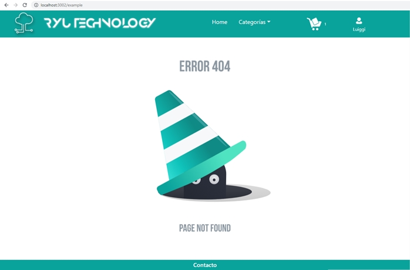
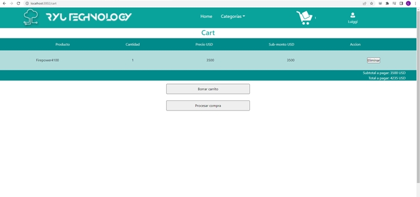
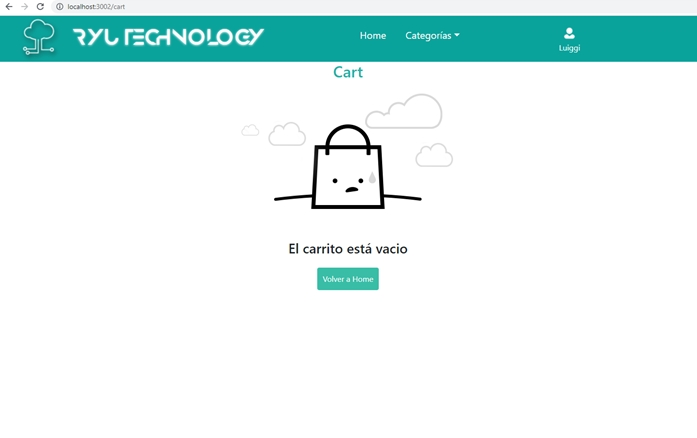
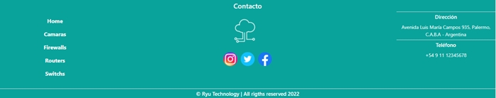
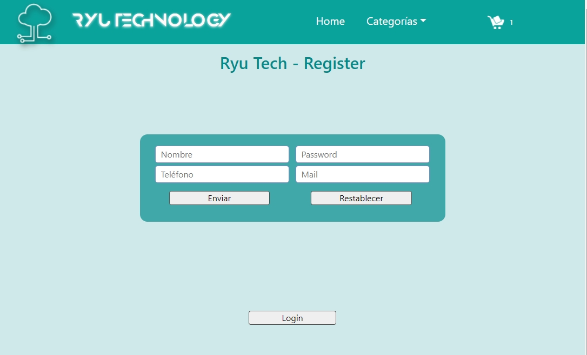
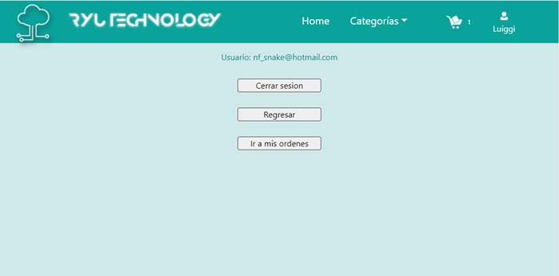
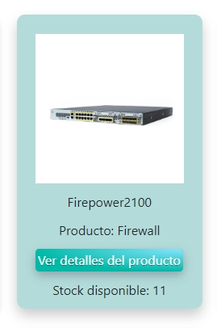
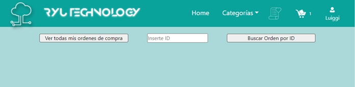
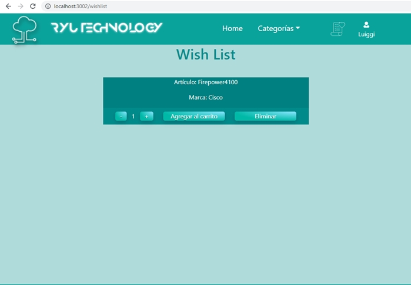

# Ryu Technology

Este site es de una empresa dedicada al rubro tecnológico de la ingeniería de redes y su aplicación en el ámbito de comunicaciones, seguridad, automatización y domótica,
tanto a nivel empresarial como en los hogares. Esta versión desarrollada en **React.js** está enfocada en productos de networking y cámaras de vigilancia, para un e-commerce.


## Comenzando 🚀

Este es un proyecto público, puedes decargarte una copia desde la pestaña code o haciendo un Clone 😊

El proyecto está formado por 4 categorías de productos:  cámaras, switchs, routers y firewalls, posee un carrito de compras, un wish list, un login para usuarios y una consulta de compras por usuario y por ID de compra.

### Pre-requisitos 📋

Este es un proyecto de React.Js, por lo que para poder visualizarlo y/o modificarlo necesitas instalar node.js.
Puedes utilizar Visual Studio Code o Sublime Text para revisarlo 🔧

### Instalación 

Estas instrucciones están hechas para **Visual Studio Code**, con el cual lo realicé:


* Instala **node.js** y **npm** desde https://nodejs.org/es/download/

* En el Visual Studio Code úbicate en el directorio donde vas a colocar el proyecto

* Clona el proyecto con `npm clone` + la dirección copiada de git `https://github.com/luiggimarquez/ryutechnology_marquez` en TERMINAL (Ctrl + ñ)

* Instala las dependencias **npm** del proyecto ubicándote en el path donde se encuentra nuestro **package.json** con: `npm install`

* Compila con `npm start`

* Abre [http://localhost:3000](http://localhost:3000) para verlo en tu navegador. Si se está usando ese puerto en tu computador, la consola te preguntará si deseas cambiar el puerto; si lo deseas, puedes liberar el puerto de la siguiente forma:

>Abre un command prompt (CMD) en modo administrador:

>>`netstat -ab` para ver el nombre de aplicación o ip que está ocupando el puerto

>>`netstat -aon` para ver el numero de pid de la app o dirección que está usando el puerto

>>`taskkill /pid [numero_pid] /F` para cerrar  el puerto

Otra opción es cambiar el puerto por defecto del proyecto; para ello debemos crear un fichero `.env` en el directorio raíz de nuestra aplicación React.JS y añadirle el puerto sobre el que queremos que se ejecute, por ejemplo:


La página se recargará cada vez que guardes cambios (CTRL + S) y podrás visualizar los errores en la consola


>Si ya tienes instalado el node.js resta solamente instalar las npm y compilar el proyecto para comenzar.


## Construido con 🛠️

* EL proyecto está desarrollado con [Create React App](https://github.com/facebook/create-react-app).

* Los estilos CSS están hechos con SASS en Visual Studio Code 1.63.2

* Para SASS está usada la dependencia `SASS` versión 1.49.9

* Está instalada la dependencia `react-bootstrap` versión 2.2.1 usada para el menú **dropdown del NavBar** para las categorías de los productos en el NavBar y para el menú **Burger** en el responsive.

* Está instalada la dependencia `react-router-bootstrap` versión 0.26.1 usada para enrutar con **<LinkContainer>** las categorías usadas en el dropdown , es el método recomendado por react-bootstrap

* Está instalada la dependencia `react-router-dom` versión 6.2.2 para los enrutamientos entre páginas.

* Está instalada la dependencia `SweetAlert2` versión 11.4.6 para las ventanas emergentes de avisos, por ejemplo está usada para indicar que se excede el stock al agregar los artículos con el ItemCount.js, para indicar los errores de login, de registro de usuario, para notificar el ID del producto y para indicar cuando un producto no se puede cargar en la compra por estar sin stock.

* Para los errores de página que no existe, como el error 404 para routes que no existen, artículos que no estan registrados en el stock, wishlist vacío, entre otros, se usó la dependencia `lottie-react`

* Como Database se usó firebase, que es una base de datos no relacional, NoSQL

* Todo el layout de la página esta hecho con flexbox realizado de forma manual.

* Todo la lógica está escrita en `JavaScript Vanilla` directamente.

* El spinner del cargado de las páginas está hecho con CSS, idea tomada de https://www.w3schools.com/ y adaptada a la página

* Las imágenes no son de mi autoría, todo es material público en internet.

* La fuente del título, fue tomada de https://befonts.com/anurati-font.html

* Los botones son del sitio https://cssbuttons.io/

## Resumen del proyecto 📜

* La base de datos, Firebase, esta configurada en la carpeta `/services`, la cual posee tres archivos, **Index.js**, que es donde se configura Firebase. Para este proyecto estos datos son privados, si deseas trabajar con tu propia base datos puedes configurarla aquí. El archivo **Firestore.js** contiene las llamadas asíncronas a la base datos, Firestore , de aquí se lee y se escribe nuestra base de datos; y el archivo **Auth.js**, posee las configuraciones para registro, login y logout de usuarios con Authentication de Firebase.


* Nuestro stock es manejado en Firebase como un array de objetos, que tiene la siguiente estructura
```
- cantidad: (number)
- categoria: (string)
- detalle: (string)
- id: (string)
- img: "/img/example.jpg"
- marca: (string)
- nombre: (string)
- precio: (number)
- tipo: (string)
```

>>Las imágenes, img, están almacenadas en una carpeta `IMG` en el folder `Public`

* La autenticación está establecida en Firebase como `Correo electrónico/contraseña`

* **ProductsAdapters.js**: `adapters` se utiliza para convertir nuestros datos adquiridos de Firebase a variables más amigables para nuestra manipulación, globalizando en nuestra app un formato local independiente al Firebase, es decir, podemos optimizar futuros cambios en nuestra base de datos de forma rápida solo cambiando nuestro Adapter sin tener que realizar otro cambio en toda nuestra aplicación.

* En **App.js** ocurren todos los enrutamientos de nuestra página mediante `react-router-dom` asi como el llamado a todos nuestros `Context`. Hay una ruta por defecto por si se ingresa un URL inválido y es capturado por una animación con `Lottie`:



* La carpeta `assets` contiene dos JSON que se usaron para las animaciones de **Lottie**

* Folder `Context`: aqui tenemos los datos que manejamos globalmente en la app:

>> **CartContex.js**: En CartContex se realiza todas las operaciones relacionadas al carrito de compras; aquí mediante `useEffect` se almacena, borra y se lee en el localStorage del navegador los datos almacenados en nuestros **carrito de compras**. Tenemos las funciones de:

- addItem: para agregar artículos al carrito.
- clearItem: para vaciar el carrito.
- eliminarItem: borrar un artículo.
- removeOutofStock: para eliminar los articulos del carrito que esten sin stock.
- getNumeroCarrito: para colocar el numero de artículos del CartWidget.
- getItemSubTotal: cálculo del subtotal de cada artículo.
- getSubtotal: cálculo del subtotal general de artículos.
- getTotal: cálculo del total de la compra con IVA.

>>**NotificationContext.js**: es el servicio de notificaciones del app. En él tenemos la declaración del `sweetalert2`. Para llamar las notificaciones pasamos tres variables como parámetros: tipo de alerta `(warning, error, success, info and question)`, un string con el mensaje y el tiempo de duración. Se utilizó la la notificación tipo `Toast`.

>>**UserContext.js**: es el servicio de autenticación de usuarios. Está configurado en autenticación persistente, hay que hacer logout para salir. En este Context tenemos las funciones de registro de usuario, `register` , `login` para iniciar sesión y `signOut` para hacer logout.

>>**WishListContext.js**: nos permite mantener en toda la app el `WishList`. Aquí en este Context mediante `addWishList`, `removewishList` y `validateItemWishList` se agregan borran y se tiene control del los items en el WishList del app. `ValidateItemWishList` permite hacer toggle en el boton de wishlist para agregar o remover el articulo. En este Context guardamos los datos en el localStorage del navegador.


* **Components**: 

- **Cart.js**: aquí tomamos los datos almacenados en Cart Context y los imprimimos en este componte. Posee dos botones, `borrar carrito` y `procesar compra`, adicional cada artículo tiene un boton para eliminarlo



Se valida cuando el carro está vacío y se elimina el widget del carrito. Aqui sale un aviso del carrito vacío y un boton para regresar a home.



Cuando se está lista la compra y se presiona `Procesar compra` se valida primero si esta logueado un usuario, de no estarlo se redirecciona mediante `useNavigate()` al componente **form.js** para realizar login o registro de usuario. Una vez logueado se habilita un boton `regresar` para volver a **cart.js**. Aqui tendremos que presionar nuevamente `procesar compra` y se ejecuta la función `createOrderAndUpdateStock` que nos creara una nueva colección en Firestore con los datos de la compra. este objeto tiene la forma:


```
buyer: {

    name: user.displayName,
    phone: user.photoURL,
    email: user.email,
    uid: user.uid
},

items: cart,
date: new Date()
total: getTotal()
```

En este punto se valida con `removeOutOfStock`  y si hay artículos fuera de stock se eliminan automáticamente lanzando una notificación.

Si todo está OK, se lanza una notificación con la ID de la compra y nos redirecciona a `/purchaseorder`, es decir, a **PurchaseOrder.js** mediante `useNavigate()`


- **CartWidget.js**: este componente genera el icono del carrito con su cantidad mediante `getNumeroCarrito` de **CartContext.js** en el **NavBar.js**. Es una ruta para ir a `Cart.js` 


- **Footer.js**: en este componente cargamos las categorias creadas dinámicamente con la colección `categorias` reutilizando la funcion `getNavBar` de **Firestore.js**. 




Hace uso del menu `NavCollapse` de `react-bootstrap` para el menú Burger en responsive.


- **Form.js**: aquí podemos hacer login / logout / register. Si no tenemos usuario logueado, aparece el menu login, con un boton register para hacer toggle entre los dos menús




Cuando el usuario inicia sesion nos aparecen tres botones, uno para cerrar sesión, otro para regresar a **Cart.js** y un tercer boton `Ir a mis ordenes` que nos conduce a **Orders.js** en donde podremos ver todas las compras hechas o consultar por ID si se posee. 



- **Items.js**: nos arma la vista previa de cada componente en **ItemListContainer.js** Posee el boton para ir a item y ver los detalles. Si el item no tiene stock valida y coloca la leyenda "sin stock"



- **ItemCount.js**: este componente realiza, mediante lectura del stock en base de datos, la validación para añadir los artículos la carrito a través de la funcion `OnAdd`. Posee tres funciones `incrementar`, valida el máximo artículos en el stock y no permite sumar más del máximo, también válida los artículos que esten agregados al carrito y los resta del máximo, para no agregar más de los que quedan en stock; `decrementar` para disminuir la cantidad de artículos agregados y `botonAgregar` que llama la función OnAdd. En esta lógica, cuando se agrega todo el stock del artículo al carrito, no permite ni sumar más ni agregar más, se dispara una notificación avisando la falta de stock. Va insertado en itemDetails.


- **ItemCountWishList.js**: al igual que itemCount, válida con el stock para no superar el límite de él al agregar un artículo del WishList al Cart.js. Permite agregar por cantidad un articulo del WishList. Va insertado en el WishList.


- **ItemDetail.js**: en este componente se cargan visualmente los card con los datos de cada producto, se llama a la función onAdd pasada del **ItemCount.js** y se envía  al funcion del carrito `addItem` para enviar los datos del item a ser agregado en el carrito.

Aqui se muestran todos los atributos del objeto, se muestra  el stock disponible, el boton para agregar al carrito, el boton para agregar o remover del wishlist, la imagen del productos y la descripcion, que posee un boton para regresar a home.


- **ItemDetailContainer.js**: en este componente se obtiene a traves de la URL con `useParam` el id del producto y se hace una busqueda en Firestore del item y se pasa como props al ItemDetail. Si no consigue el item en la base de datos, lanza una animaciíon de Lottie para avisar que no se encontró

- **ItemList.js**: se encarha de pasar como props los datos mostrados en Item, es decir, la vista previa del producto que aparece en los cards del **ItemListContainer.js**

- **ItemListContainer.js**: recibe como props de **itemList.js** los props con los datos de los productos descargados de la base de datos; mediante un map pasa a **Item** cada producto para su vista en home.

-**NavBar.js**: la cabecera superior de nuestra página, el Navbar. Recibe mediante `getNavbar` del Firestore las categorias de la coleccion `categorias` del Firestore. Aqui se inserta el **CartWidget**, el **WishListWidget** y el nombre de usuario conectado. Mediante Boostrap, tenemos el menú despleglable y el menú burger en el responsive.


- **Ordersjs**: Este componente es llamado desde **Form.js** y su función es consultar las ordenes de compra hechas por el usuario logueado, si no hay usuario, lanza una animación de  
`lottie`. Aquí se puede consultar todas las ordenes de compra del usuario, se salen en un listado o si tenemos el ID de alguna se puede consultar.



- **PurchaseOrden.js**: vendria siendo la orden de compra. Después de procesar la compra en **Cart.js** nos redirecciona aquí, nos indica en una nofiticación el número de orden y en la página muestra todos los datos de la compra. Importante añadir que está ligada al UID del usuario, es decir, el ID de sesión de usuario de firebase, de esta forma podemos chequear esta info a futuro en cada sesión de usuario.


- **WishList.js**: Lista de deseos, podemos agregar items a nuestra lista y luego comprarlos, se almacenan en el localStorage. Se ha añadido al wishlist la funcion de seleccionar cantidades, siendo validadas al igual que en el **ItemDetail**. Aquí esta insertado el componente **ItemCountWishList** para controlar la cantidad de productos a agregar y mediante la funcion `onAddWishList` podemos agregar los artículos a nuestro carrito de compras en **Cart.js**.





- **WishListWidget.js**: componente que carga la imagen de nuestra wishlist. Proporciona un vínculo a **WishList.js**


## Autor✒️


Este proyecto fue realizado para las clases de React.js de CoderHouse por:

**Ing. Luiggi Márquez** - [GitHub Profile](https://github.com/luiggimarquez) ✌️

Buenos Aires, Argentina 2022 :argentina: