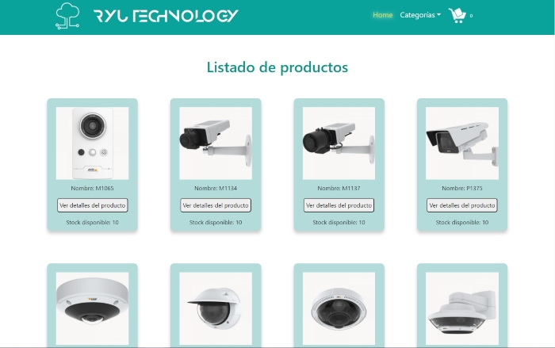
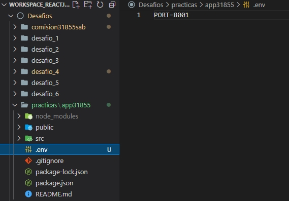

# Ryu Technology

Este site es de una empresa dedicada al rubro tecnológico de la ingeniería de redes y su aplicación en el ámbito de comunicaciones, seguridad, automatización y domótica,
tanto a nivel empresarial como en los hogares. Esta versión desarrollada en **React.js** está enfocada en productos de networking y cámaras de vigilancia, para un e-commerce.

## Comenzando 🚀

Este es un proyecto público, puedes decargarte una copia desde la pestaña code o haciendo un Clone 😊

El proyecto está formado por 4 categorías de productos:  cámaras, switchs, routers y firewalls, posee un carrito de compras, un wish list, un login para usuarios y una consulta de compras por usuario y por ID de compra.

### Pre-requisitos 📋

Este es un proyecto de React.Js, por lo que para poder visualizarlo y/o modificarlo necesitas instalar node.js.
Puedes utilizar Visual Studio Code o Sublime Text para revisarlo 🔧

### Instalación 

Estas instrucciones están hechas para **Visual Studio Code**, con el cual lo realicé:

* Instala **node.js** y **npm** desde https://nodejs.org/es/download/

* En el Visual Studio Code úbicate en el directorio donde vas a colocar el proyecto

* Clona el proyecto con `npm clone` + la dirección copiada de git `https://github.com/luiggimarquez/ryutechnology_marquez` en TERMINAL (Ctrl + ñ)

* Instala las dependencias **npm** del proyecto ubicándote en el path donde se encuentra nuestro **package.json** con: `npm install`

* Compila con `npm start`

* Abre [http://localhost:3000](http://localhost:3000) para verlo en tu navegador. Si se está usando ese puerto en tu computador, la consola te preguntará si deseas cambiar el puerto; si lo deseas, puedes liberar el puerto de la siguiente forma:

>Abre un command prompt (CMD) en modo administrador:

>>`netstat -ab` para ver el nombre de aplicación o ip que está ocupando el puerto

>>`netstat -aon` para ver el numero de pid de la app o dirección que está usando el puerto

>>`taskkill /pid [numero_pid] /F` para cerrar  el puerto

Otra opción es cambiar el puerto por defecto del proyecto; para ello debemos crear un fichero `.env` en el directorio raíz de nuestra aplicación React.JS y añadirle el puerto sobre el que queremos que se ejecute, por ejemplo:

La página se recargará cada vez que guardes cambios (CTRL + S) y podrás visualizar los errores en la consola

>Si ya tienes instalado el node.js resta solamente instalar las npm y compilar el proyecto para comenzar.

## Construido con 🛠️

* EL proyecto está desarrollado con [Create React App](https://github.com/facebook/create-react-app).

* Los estilos CSS están hechos con SASS en Visual Studio Code 1.63.2

* Para SASS está usada la dependencia `SASS` versión 1.49.9

* Está instalada la dependencia `react-bootstrap` versión 2.2.1 usada para el menú **dropdown del NavBar** para las categorías de los productos en el NavBar y para el menú **Burger** en el responsive.

* Está instalada la dependencia `react-router-bootstrap` versión 0.26.1 usada para enrutar con **<LinkContainer>** las categorías usadas en el dropdown , es el método recomendado por react-bootstrap

* Está instalada la dependencia `react-router-dom` versión 6.2.2 para los enrutamientos entre páginas.

* Está instalada la dependencia `SweetAlert2` versión 11.4.6 para las ventanas emergentes de avisos, por ejemplo está usada para indicar que se excede el stock al agregar los artículos con el ItemCount.js, para indicar los errores de login, de registro de usuario, para notificar el ID del producto y para indicar cuando un producto no se puede cargar en la compra por estar sin stock.

* Los errores de página, como el error 404 para routes que no existen, articulos que no estan registrados en el stock, wishlist vacío, entre otros, se usó la dependencia `lottie-react`

* Como Database se usó firebase, que es una base de datos no relacional, NoSQL

* Todo el layout de la página esta hecho con flexbox realizado de forma manual.

* Todo la lógica está escrita en `JavaScript Vanilla` directamente.

* El spinner del cargado de las páginas está hecho con CSS, idea tomada de https://www.w3schools.com/ y adaptada a la página

* Las imágenes no son de mi autoría, todo es material público en internet.

* La fuente del título, fue tomada de https://befonts.com/anurati-font.html

* Los botones son del sitio https://cssbuttons.io/

## Resumen del proyecto 📜

* La base de datos, Firebase, esta configurada en la carpeta /services, la cual posee tres archivos, Index.js, que es donde se configura Firebase. Para este proyecto estos datos son privados, si deseas trabajar con tu propia base datos puedes configurarla aquí. El archivo Firestore.js contiene las llamadas asícronas a la base datos, Firestore , de aquí se lee y se escribe nuestra base de datos; y el archivo Auth.js, posee las configuraciones para registro, login y logout de usuarios con Authentication de Firebase.

## Autor✒️

Este proyecto fue realizado para las clases de React.js de CoderHouse por:

**Ing. Luiggi Márquez** - [GitHub Profile](https://github.com/luiggimarquez) ✌️

Buenos Aires, Argentina 2022